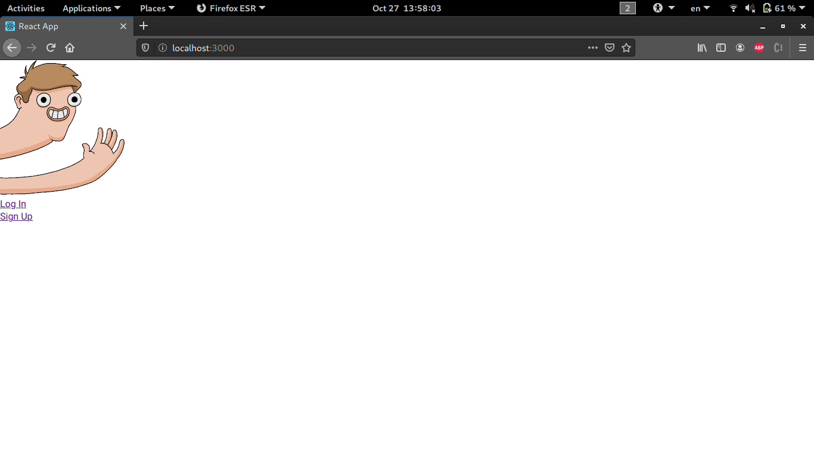

# rails-react-auth-webapp


## Prerequisites

- Postgresql installed and configured with username and a password
- rbenv  *v1.1.2>=*  installed to install ruby and gems
- yarn *v1.22.5>=*

## Requirements

#### Database configuring:

- Edit `config/database.yml` to specify postgres username and password as follow: 

```yml
# This needs to stay untouched
default: &default
  adapter: postgresql
  encoding: unicode
  pool: <%= ENV.fetch("RAILS_MAX_THREADS") { 5 } %>

#to edit
development:
  <<: *default
  database: db_dev
  host: 127.0.0.1
  username: <username>
  password: <password>
#to edit
test:
  <<: *default
  database: db_test
  host: 127.0.0.1
  username: <username>
  password: <password>
  
# This won't be used in our case because the app will never be in production
production:
  <<: *default
  database: ruby_react_authen_production
  username: <username>
  password: <password>

```

- Run these commands to install the ruby version used in this project

``` shell
user@host:$ rbenv install 2.7.4
user@host:$ rbenv local 2.7.4

```

- Install bundler et gems

	```shell
	user@host:$ gem install bundler
	user@host:$ bundle install
	```

	

## Run the webapp

We can start by running the front-end server (reactJS)

### Front-end server start

- you can start the front-end server on localhost with yarn, for this run these commands:

	```shell
	#from the project root
	user@host:$ cd client
	user@host:$ yarn start
	```

	the server will run on localhost port 3000 *http://localhost:3000*

### Back-end server (ruby on rails) start

- we need to create the databases (you must configure the config/database.yml first as shown [here](#database-configuring)), for this run these commands:

	```shell
	#from the project root
	user@host:$ rails db:migrate
	user@host:$ rails db:create
	user@host:$ rails db:seed
	```

	

- we need to start the server on localhost and it must be on 3001 port:

	```shell
	#from the project root
	user@host:$ rails s -p 3001
	```


### Application main page

- To visit the webpage: http://localhost:3000/, it will look something like this:
	
	
- If you are lazy to signup, a user already exists: `username: doritos  password: Ch33zy$` 

- So you can always signup and create users as much as you want.


Enjoy and Thank you for testing my webapp !

